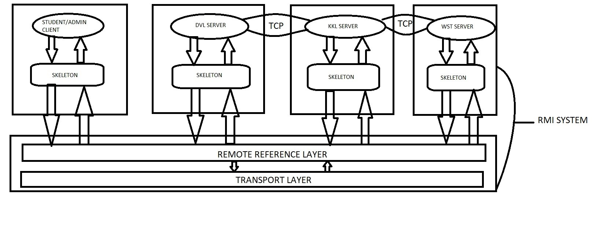

# Distributed-Room-Reservation-System-using-Java-RMI

## Client Server Architecture Distributed Room Reservation System (DRRS) using Java RMI

The Distributed Room Reservation System is a distributed system that allows the Administrators to manage rooms by creating and deleting according to their availability. It allows the Students to manage their bookings by letting them book, cancel and check available rooms.

The system uses **Java RMI** to facilitate the communication between remote objects. It also uses **UDP connection** to communicate and get available timeslots from peer servers.

## Java RMI

The RMI ( Remote Method Invocation ) is an API  that provides a mechanism to create distributed applications In java. The RMI mechanism works by allowing an object to invoke a method on an object running in another JVM.

## 	ARCHITECTURE 

